# 📝 Reflection of the Study - [2025.05-22]

## 1. 📌 학습 주제
- 언리얼 엔진 설치
- 뷰포트 탐색 및 액터 사용
- C++ vs 블루프린트

## 2. 🧠 배운 내용 정리

### ✔️ Objects vs Structs
- 용어
    - Objects - 데이터와 기능의 집합 (ex. Actor - Cube, BP_Projectile / Componenets - StaticMeshComponent etc)
    - Struct - 크기가 작은 오브젝트 (ex. Vectors, Rotator, Transforms)

### ✔️ 폰
- 실행 중 F8 길게 누르면 플레이어가 있던 위치에서 폰 생성됨
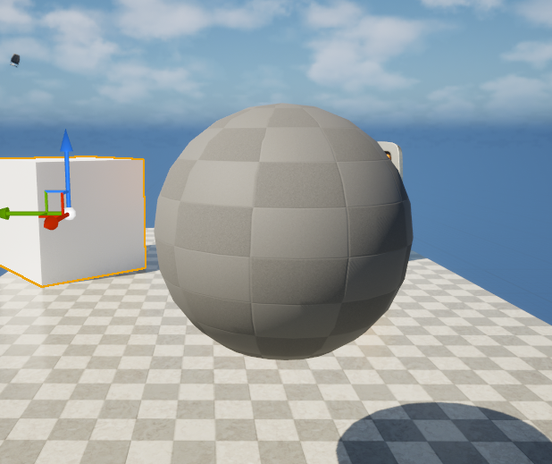
    - 실행중에도 액터와 상호작용 할 수 있음

### ✔️ 액터의 위치
- 이벤트그래프에서 폰의 위치에서 액터를 스폰하여 impulse를 통해 앞으로 공을 던지는 프로그램을 작성하려면?
    1. get player pawn -> get actor location (폰 위치 찾아줌) -> BP_Projectil의 transform 옵션 중 location에 연결
    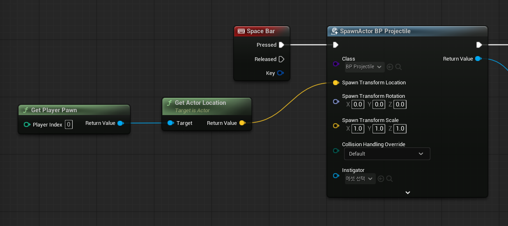
    2. impulse 방향을 수정 (이때 앞으로 가려면 x < 0 으로 수정)
        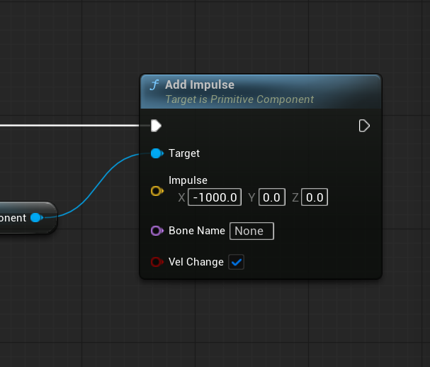

### ✔️ 액터의 회전
- Get Actor Rotation을 사용하면 플레이어가 시점 회전해도 폰에는 반영되지 않는다. 
- Get Control Rotation을 사용하면 문제없이 적용된다.
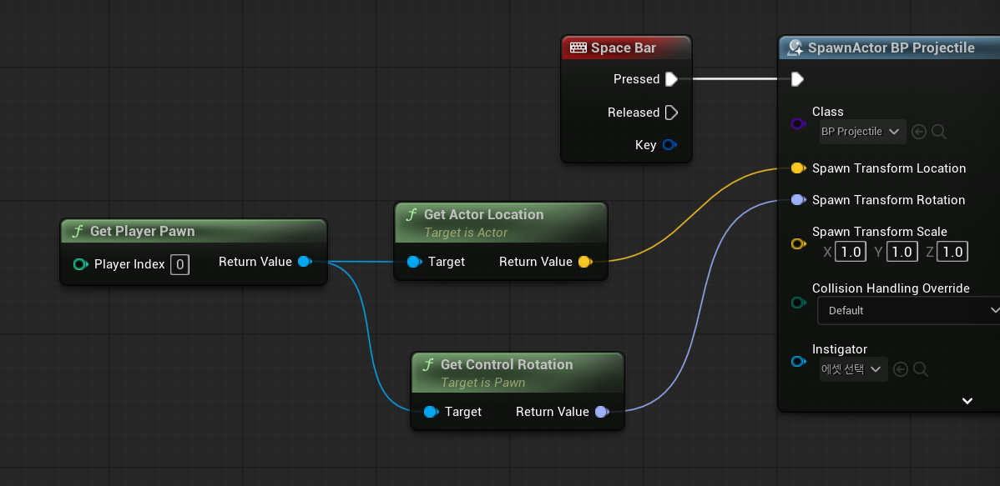
    - 플레이어의 위치에서 공이 생성된다. 플레이어의 시점 각도를 기반으로 공이 회전한다.

- 벡터를 이용하여 플레이어가 바라보는 방향으로 공 던지기

    - 폰의 위치 + 방향을 벡터의 입력값으로 사용할 수 있다.
    - Get Actor Forward Vector는 폰의 위치와 방향 정보를 조합해 현재 플레이어가 바라보고 있는 시점을 정면으로 한다.
    - 이를 Impulse 클래스와 연결하여 전방으로 공을 던질 수 있다.

### ✔️ 에셋
- 에셋 가져오는 방법
    - 에픽 게임즈 FAB 들어가기
    - 원하는 에셋 고르기 
    - 나의 라이브러리로 추가하기
    - 원하는 프로젝트에 로드하기
- 에셋 가져오면 다양한 액터들을 drag&drop하는 것으로 쉽게 사용할 수 있다.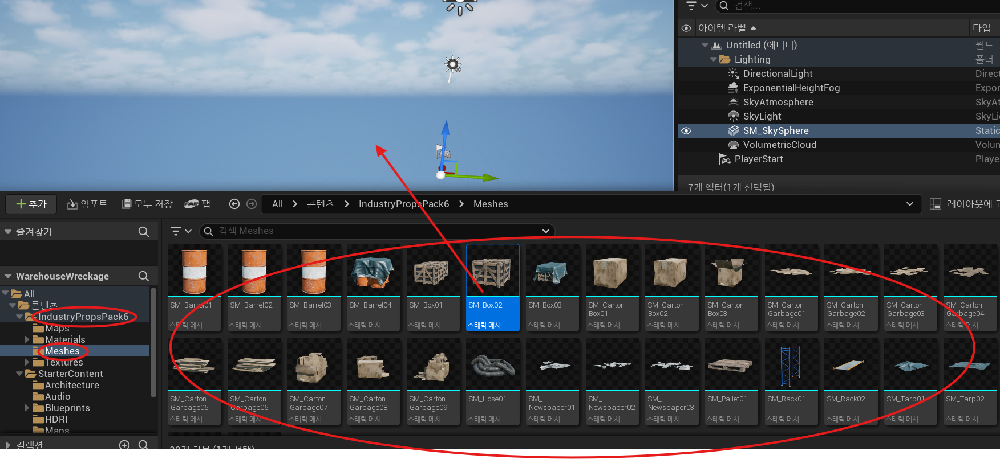

### ✔️ 지오메트리 브러쉬 (BSP)
- 더 많은 옵션을 제공하는 엑터 배치 패널 열기
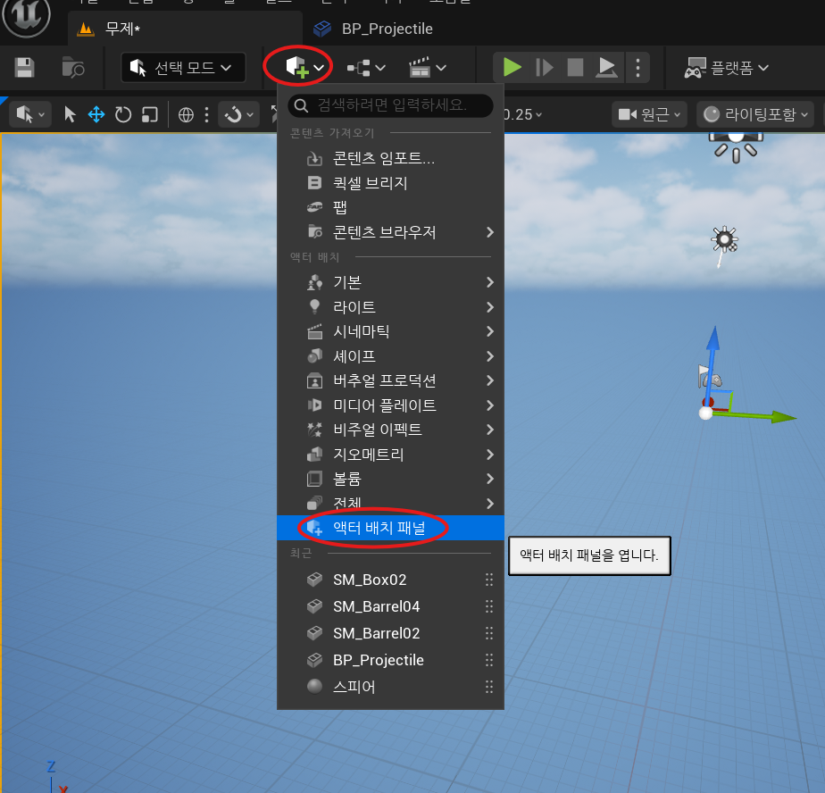
- 지오메트리 섹션 선택
    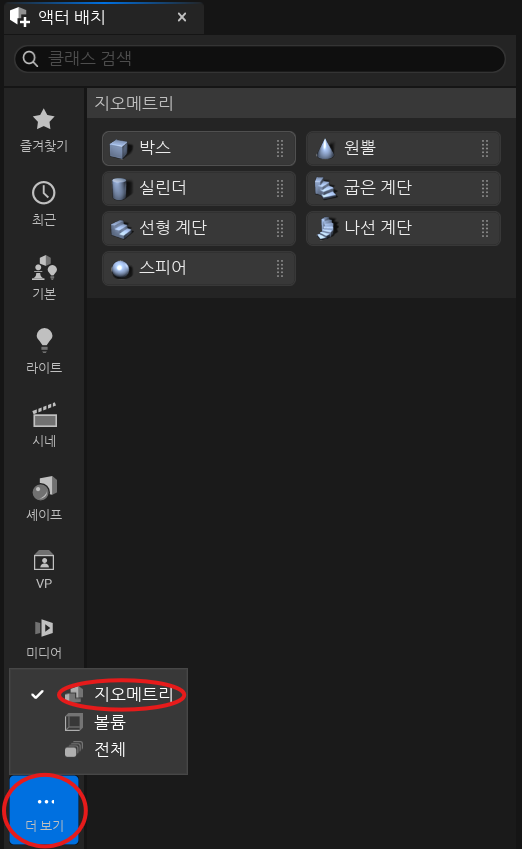

- 내부 공간이 있는 창고를 만든다!
    - 박스 하나 생성하고 Walls로 이름 바꾸기
    - Brush Setting 조정하기 (이때 Transform의 Scale은 건들지 않는다. 이후 비율 이상할 수 있음.)
        - Walls x : 36미터, y : 29미터, z : 9.6미터
        - WallsSubtract x : 34미터, y : 27미터, z : 7.6미터
    - WallsSubtract의 브러쉬 세팅을 Additive -> Subtractive로 바꾸기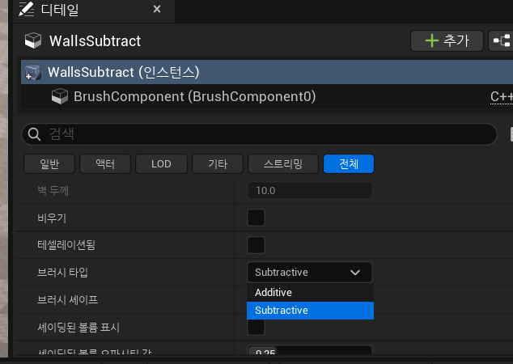
    - 방 생성 완료!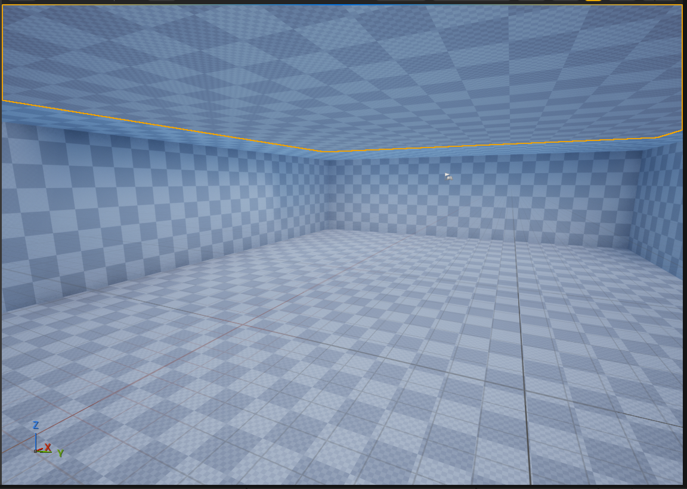

- 위에서 만든 창고(Main)을 게임을 시작할 때 기본으로 설정하기
    - 편집 -> 프로젝트 세팅
    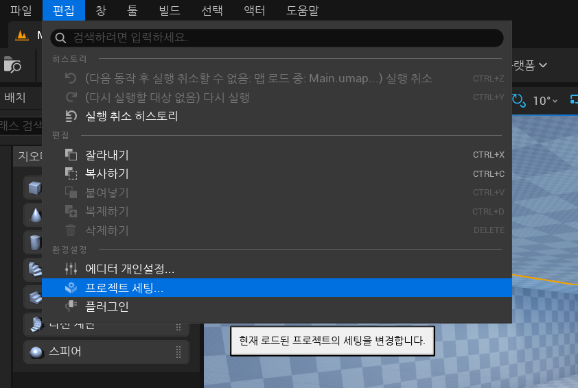
    - 맵 & 모드 -> 에디터 시작맵과 게임 기본맵 모두 Main으로 바꾸기기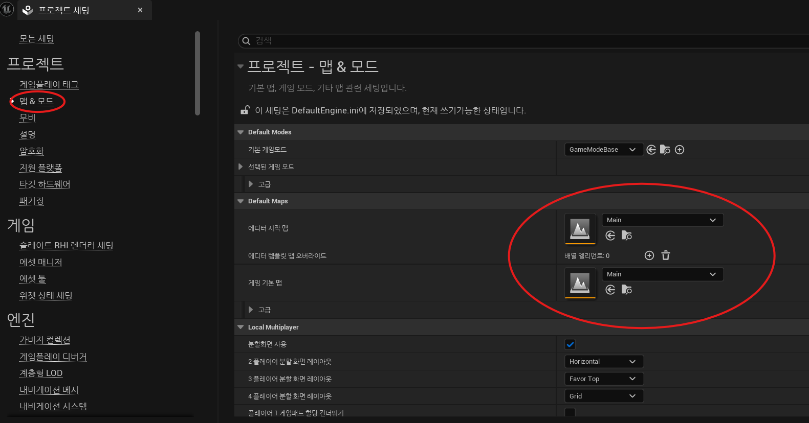

- 같은 종류 액터 폴더에 넣기
    - Window, Window2 -> Windows 폴더
    - 모두 잠아서 우클릭 -> goto -> 새 폴더 Windows 만들기
    

### ✔️ 재료와 조명
- 재료
    - 필터 사용해서 머터리얼 누르면 재료만 뜬다!
    - 액터 누른 상태로 드래그앤드랍하면 재료가 적용된다.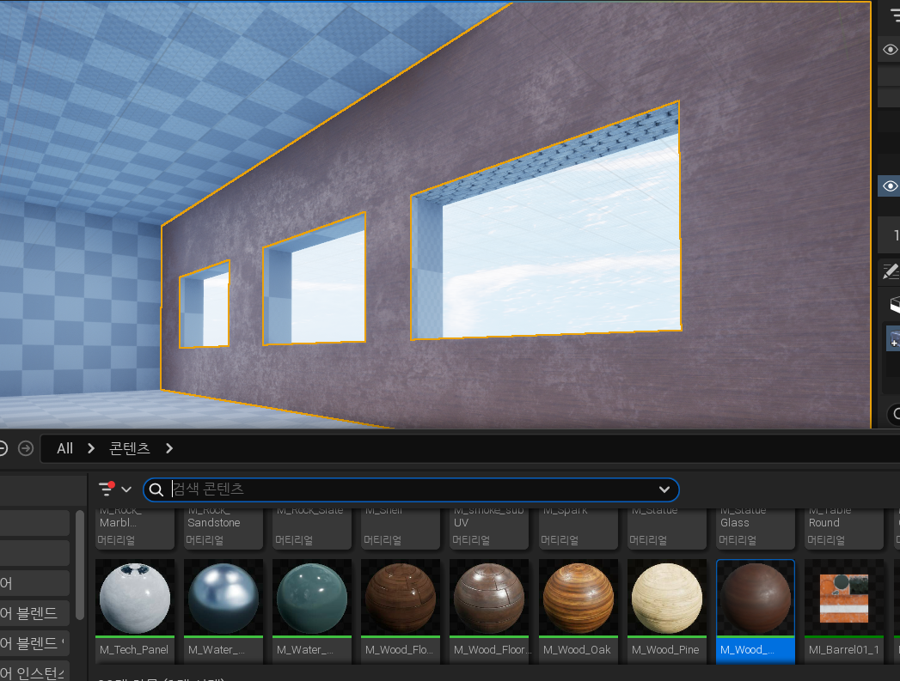

- 조명
    - 아웃라이너에 light라고 검색하면 조명 관련 액터가 검색된다.
    - 빛의 각도 조절을 할 수 있다.
    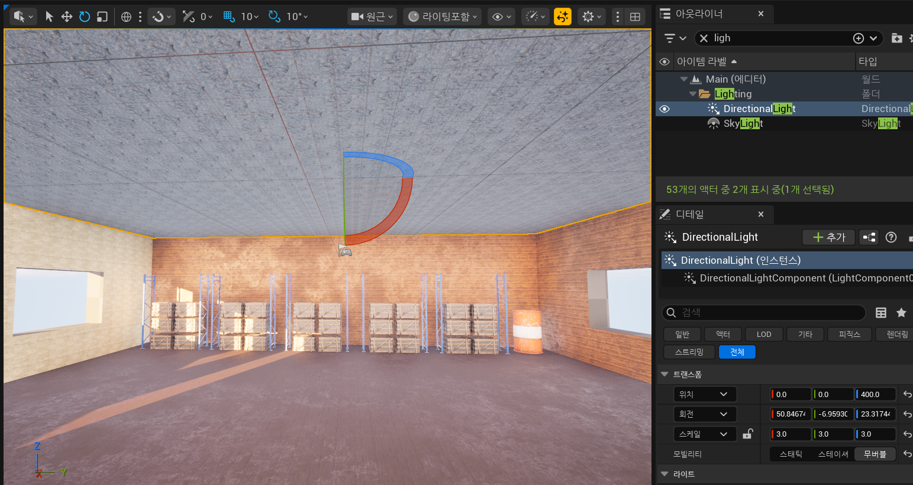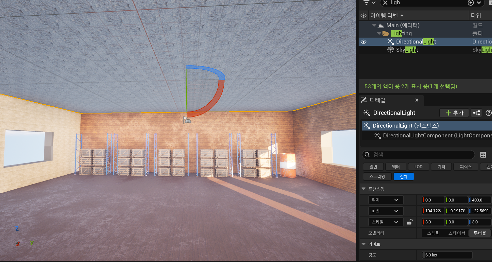

### ✔️ 액터 컴포넌트
- 선반을 합치고 이것이 분리되지 않도록 하려면?
    - Rack01의 StaticMeshComponent의 자식으로 Rack03를 넣는다!
    - 이는 액터나 StaticMeshComponent를 움직이면 선반도 함께 움직일 수 있도록 한다.
    - 선반의 Location을 보면 (0,0,0)으로 설정되어 있다. 절대 위치로는 사실이 아니지만, Rack01을 기준으로한 상대위치로는 (0,0,0)이 맞다.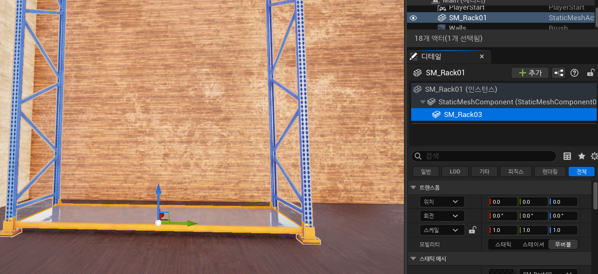

- 뼈대에 선반 4개를 자식으로 붙인 상태에서 루트(StaticMeshComponent), 즉 뼈대에만 피직스 시뮬레이트를 설정하고 공을 던지면 선반과 분리되지 않고 딱 붙어있다!
    - 주의할 점은, 자식인 선반들에는 피직스 설정하면 안된다. 떨어진다.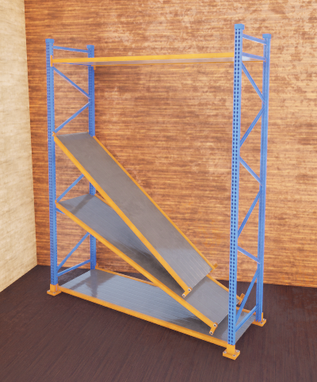

### ✔️ 충돌 메시
- 배럴통을 여러층 쌓으면 서로 튕겨져나간다 -> 언리얼의 충돌 계산 방식때문
    - 와이어프레임 옵션으로 메시를 볼 수 있음
    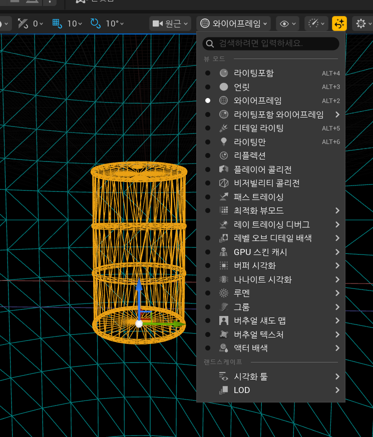
    - 플레이어 콜리전 옵션으로 충돌면 볼 수 있음
    
- 충돌 시 튕기는 것을 막는 방법
    - 콘텐츠 드로어에서 배럴 매시 더블 클릭 -> 콜리전 -> z축 기준으로 충돌 단순화하는 옵션 적용 (충돌 부위가 위아래로 평평해짐!)
    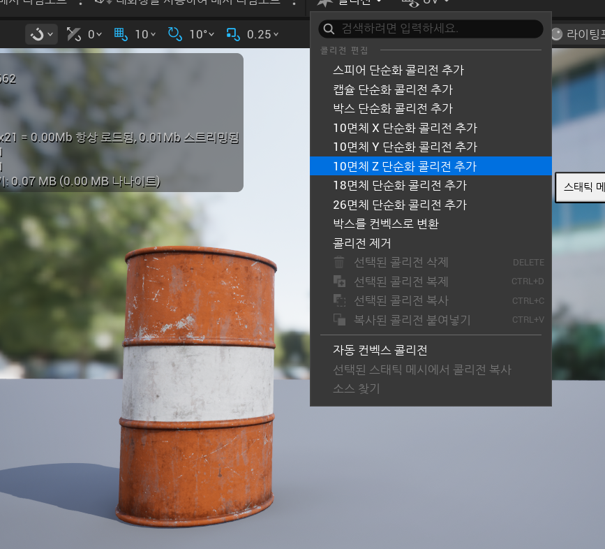

- BP_Barrel 클래스 만들어서 적용!

### ✔️ 변수
- 남은 탄약 개수 띄우기!
    - 창 -> 내 블루프린트 -> 변수(ammo) 추가
    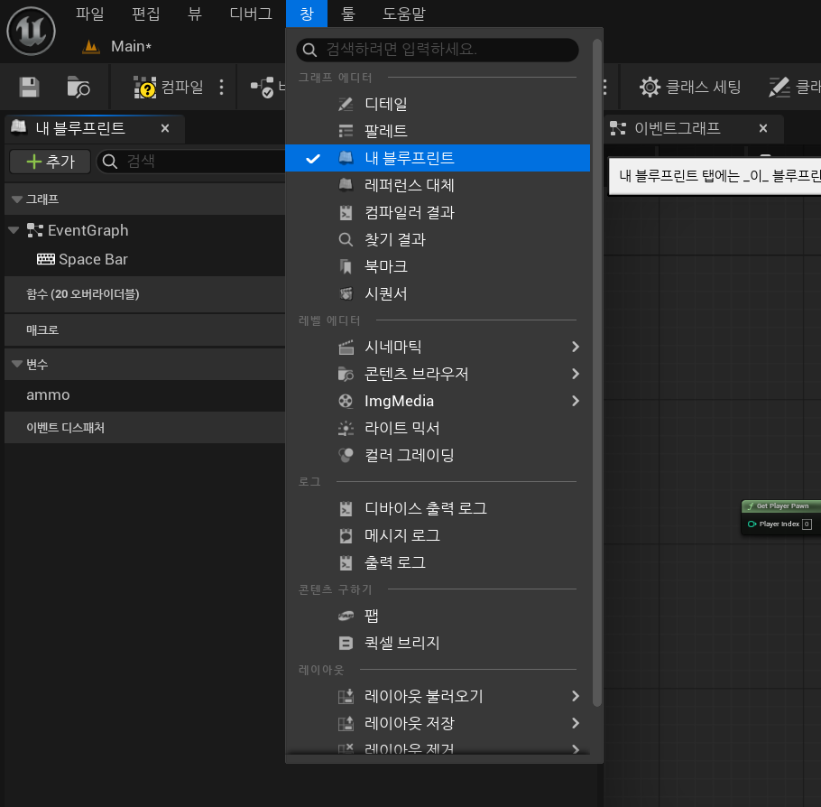
    - ammo 드래그 앤 드랍으로 get, set 옵션 사용
    
- 여기까지의 구현에선 탄약이 다 떨어져 0이 돼도 계속 공 던짐

### ✔️ 분기 노드
- 남은 탄약이 0 이하이면 공 던지기를 멈추는 로직을 구현한다.
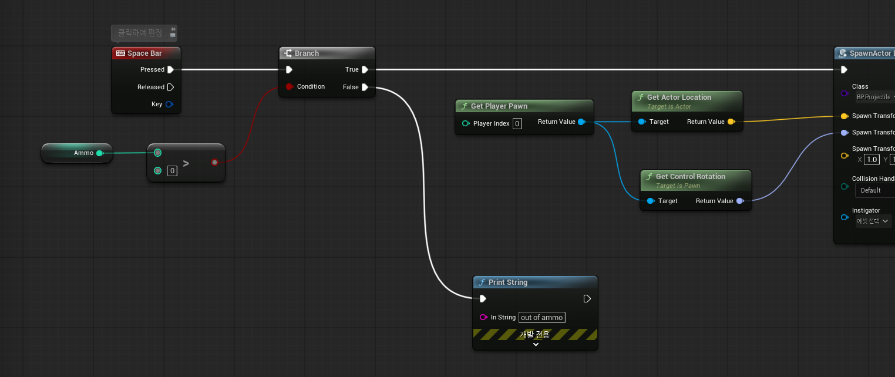
    - greater는 ammo가 0보다 크면 true, 작으면 false를 반환한다.
    - branch는 condition(greater의 output)에 따라 다른 기능을 수행할 수 있도록 한다. 

### ✔️ 함수
- 코드 정리를 위한 기능 중 하나인 코멘트부터 살펴본다

     - 발사체를 스폰하는 기능을 코멘트로 묶는다
     - 하지만 여전히 보기 어렵다. 함수 기능이 더욱 유리하다.

- 함수 사용 방법
    - 함수로 묶을 부분을 모두 잡기 -> 우클릭 -> 함수로 접기
    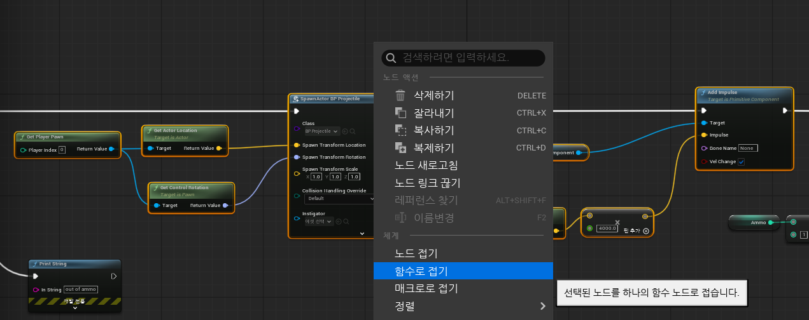
    - 결과!
    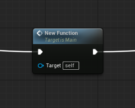
    
    - 필요한 부분을 모두 함수화 시킨 결과
    
